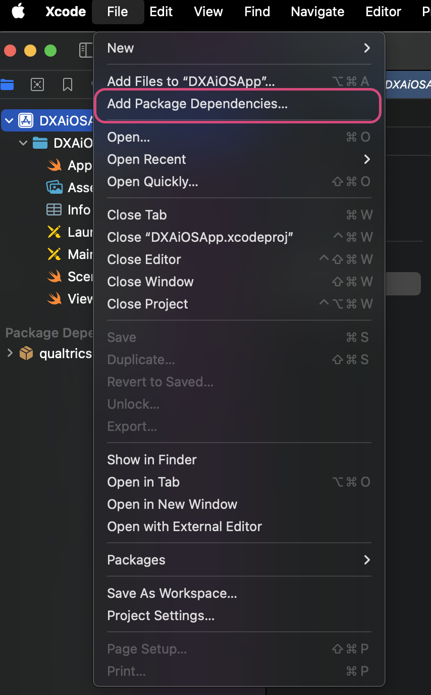
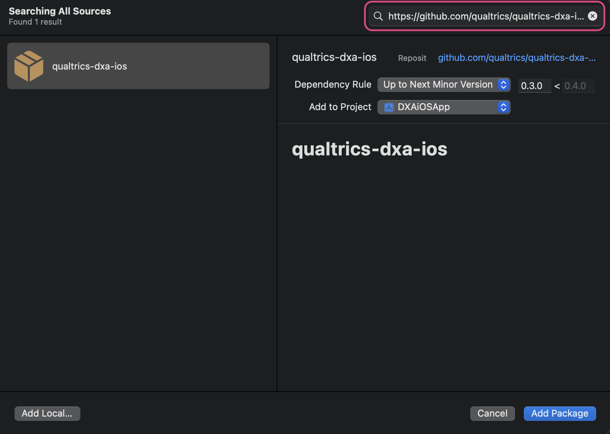
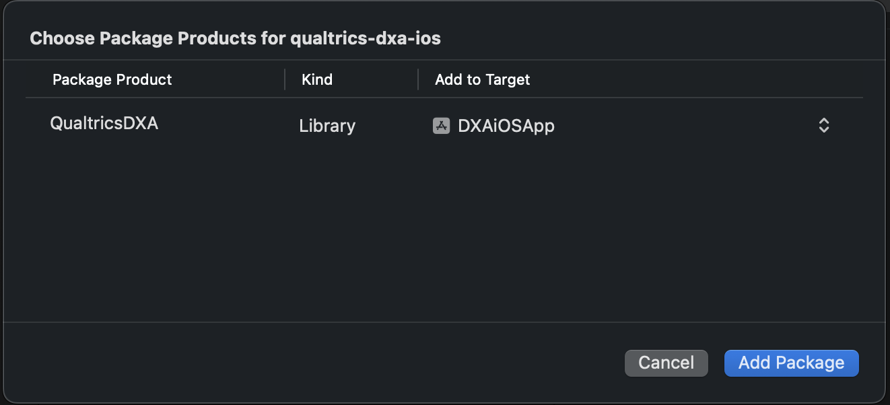
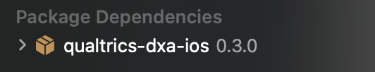

# QualtricsDXA

This package is Qualtrics' DXA iOS SDK to be used by iOS application via Swift Package Manager. 
All the public APIs and supported scenarios are documented here: [SDK overview](https://api.qualtrics.com/43fcfbd59fcff-overview).
The release notes for each version can be found here: [Release Notes](https://api.qualtrics.com/078815f3f0b0c-app-session-replay-release-notes).

## Installation

> For CocoaPods guide, please refer to official [documentation](https://api.qualtrics.com/d88lurnfmqr8p-get-started)

### XCode installation

#### 1. Navigate to `File`->`Add Packages...`


#### 2. Search for the package repository url: `https://github.com/qualtrics/qualtrics-dxa-ios` in the top right corner and click `Add Package`:


#### 3. Add package to your target:


#### 4. Verify that the package has been added to your Project Navigator in Xcode, under `Package Dependencies`:


### Package dependency

#### 1. In your `Package.swift` file, add QualtricsDXA as a dependency:

> You can check the latest available version in the [Release Notes](https://api.qualtrics.com/078815f3f0b0c-app-session-replay-release-notes)
```swift
dependencies: [
    .package(url: "https://github.com/qualtrics/qualtrics-dxa-ios.git", .upToNextMinor(from: "0.3.0"))
]
```

Use `.upToNextMinor` to take advantage of bug fixes and new features that are non-breaking, ensuring stability as the package progresses.

#### 2. Add QualtricsDXA as a dependency to target that depends on the SDK:

```swift
targets: [
    .target(name: "YourTarget", dependencies: [
        .product(name: "QualtricsDXA", package: "qualtrics-dxa-ios")
    ])
]
```

## Issues / Support
For help on the Qualtrics SDK, you will want to reach out to our support team via our [Support Portal]( https://www.qualtrics.com/support/).
If you do not have a login, please work with your brand admin to file a support ticket.
We do not take support requests or community PRs through GitHub.